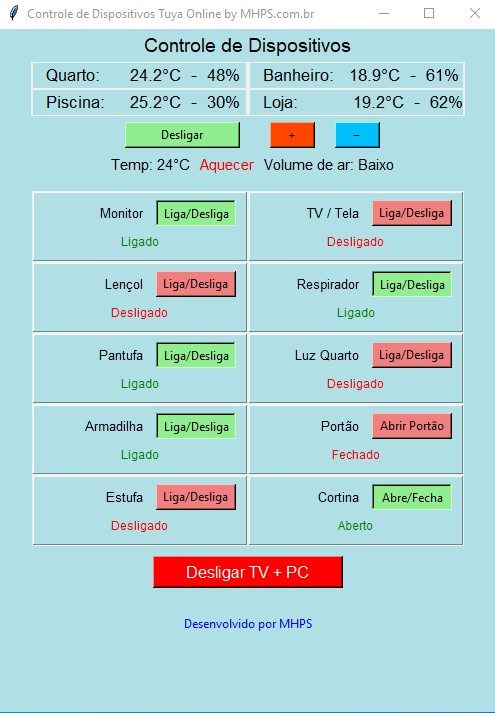

# Tuya Smart-life PC Nuvem

Este projeto oferece uma interface gráfica em Python (Tkinter) para controlar dispositivos inteligentes integrados com a nuvem da Tuya Smart Life. Ele permite controlar luzes, cortinas, alarmes, sensores de temperatura/umidade, ar-condicionado infravermelho e muito mais diretamente do seu computador com Windows sem a necessidade de uso de emuladores ou qualquer tipo de virtualização.



## 🧩 Funcionalidades

- Conexão com a API Tuya Cloud
- Interface gráfica com exibição em duas colunas
- Monitoramento de sensores (temperatura e umidade)
- Controle de:
  - Dispositivos comuns (ligar/desligar)
  - Cortinas (abrir/fechar)
  - Portão automático
  - Alarme sonoro com temporização
  - Ar-condicionado via controle infravermelho (ligar, desligar, temperatura, modo, intensidade do vento)
- Botão especial para desligar TV e o computador

## 📂 Arquivos

- `online.py`: Script principal com a interface e lógica de controle dos dispositivos via nuvem Tuya.
- `meus_dispositivos_online.json`: Lista dos dispositivos registrados com `id`, nome, tipo e código de controle (`code`).
- `acess.json`: Armazena as credenciais da API Tuya (Access ID, Access Key e Endpoint).
- `online.jpg`: Captura de tela da interface do programa.

## 🛠️ Pré-requisitos

- Python 3.9 ou superior
- Conta de desenvolvedor na [Tuya Cloud](https://iot.tuya.com/cloud/)
- Biblioteca `tuya-connector`:
  ```bash
  pip install tuya-iot-py-sdk
  ```

## ▶️ Como usar

1. Clone este repositório:
   ```bash
   git clone https://github.com/seuusuario/tuya-smartlife-pc-nuvem.git
   cd tuya-smartlife-pc-nuvem
   ```

2. Configure o arquivo `acess.json` com as suas credenciais da Tuya:
   ```json
   {
     "ACCESS_ID": "seu_access_id",
     "ACCESS_KEY": "seu_access_key",
     "API_ENDPOINT": "https://openapi.tuyaus.com"
   }
   ```

3. Edite o `meus_dispositivos_online.json` com os dispositivos que deseja controlar, seguindo o modelo já incluso.

4. Execute o script:
   ```bash
   python online.py
   ```

## 🧠 Dicas

- Para usar o controle de ar-condicionado, verifique se o dispositivo infravermelho foi pareado corretamente com o controle físico no app Tuya.
- O layout é responsivo e funciona bem em telas pequenas.
- Os sensores são atualizados automaticamente a cada 40 segundos.

## 🚨 Atenção

> Este programa utiliza comandos para **desligar o PC via script**. Use com cuidado e revise o botão `Desligar TV + PC` caso adapte para outro sistema operacional.

## 📄 Licença

Distribuído sob a licença MIT. Veja `LICENSE` para mais detalhes.

## 👨‍💻 Desenvolvido por

[MHPS](https://www.mhps.com.br){:target="_blank"} – Soluções em automação e sistemas inteligentes.
